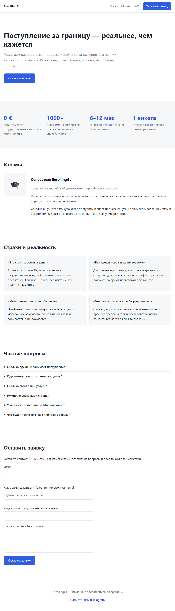

# EnrollingGL

Лендинг о помощи с поступлением за границу. Посетитель читает о нас,
мифах и FAQ — и оставляет заявку; она мгновенно приходит нам в Telegram.

## О проекте

EnrollingGL — одностраничный лендинг (одна прокручиваемая страница без
переходов на другие адреса) о помощи с поступлением в университет за
границей: в основном речь о Европе, но интересующимся Азией тоже
отвечаем. Это совместный проект с другом-соучредителем — он сам недавно
прошёл весь путь поступления и теперь помогает пройти его другим.

Страница не пытается заменить консультацию и не выкладывает подробный
пошаговый гайд по поступлению — это осознанно. Её задача скромнее и
конкретнее: показать человеку, что поступление реальнее, чем кажется,
снять пару типичных страхов (блок «Страхи и реальность»), ответить на
частые вопросы (FAQ) и подвести к одному простому действию — оставить
заявку. Дальше с человеком связываются сами, лично, обычно в Telegram.

Для кого страница: для тех, кто задумывается о поступлении за границу,
но не знает, с чего начать, боится бюрократии или просто не верит, что
это ему по силам.

Скриншот страницы целиком:



## Как устроен код

Всё написано на чистых HTML, CSS и JavaScript (ES-модули) — без
фреймворков, сборщиков и npm-зависимостей. Единственное, для чего в
проекте вообще используется Node.js — встроенный в него тестраннер
(`node --test`), см. раздел «Запуск и тесты» ниже.

Карта проекта:

- **`index.html`** — HTML-скелет страницы: пустые `<section>`-контейнеры
  под каждый блок и разметка формы заявки. Текстов внутри почти нет — они
  приходят из `js/data/content.js`.
- **`css/style.css`** — вся вёрстка и стили; цвета вынесены в
  CSS-переменные (`--accent`, `--text` и т.д.) в начале файла, поменять
  оформление можно, не бегая по всему файлу.
- **`js/app.js`** — точка входа: рендерит все секции, включает форму,
  хранит константу `WORKER_URL` (см. «Деплой»).
- **`js/data/content.js`** — **весь** текстовый контент сайта: заголовки
  hero, метрики, блок «о нас», мифы, FAQ, ссылка на Telegram.
- **`js/core/validate.js`** — валидация анкеты: обязательность имени и
  контакта, допустимые форматы контакта (`@username`, телефон, email),
  ограничения длины полей. Обычные функции, без обращений к странице.
- **`js/core/submit.js`** — отправка заявки на Worker через `fetch`.
- **`js/ui/sections.js`** — превращает данные из `content.js` в
  HTML-разметку и вставляет её в `<section>`-контейнеры.
- **`js/ui/form.js`** — обработка отправки формы: валидация при submit,
  показ ошибок по полям, honeypot-поле, блокировка кнопки на время
  запроса.
- **`worker/worker.js`** — Cloudflare Worker, единственный «бэкенд»
  проекта: один файл, ничего не импортирует из `js/`. Заявка здесь
  проверяется заново — фронту не доверяем: те же лимиты длины, что и в
  `validate.js` (имя и контакт — до 100 символов, «куда» — до 200,
  вопрос — до 1000), honeypot-поле `company` (заполнено — тихо отвечаем
  `ok: true` и ничего не шлём в Telegram) и rate-limit — не больше 5
  заявок в минуту с одного IP; счётчик живёт в памяти Worker'а и
  сбрасывается при перезапуске.
- **`worker/wrangler.toml`** — настройки Worker'а: имя, `ALLOWED_ORIGIN`.
- **`tests/*.test.js`** — 27 тестов на встроенном `node:test`.
- **`docs/screenshot.png`** — скриншот страницы для этого README.

**Почему контент отделён от разметки.** `js/data/content.js` — это
просто массивы и объекты, без единого тега HTML и без логики.
`js/ui/sections.js` берёт эти данные и превращает в разметку. Смысл: чтобы
поправить текст, добавить миф или вопрос в FAQ, достаточно отредактировать
один файл с данными — код и разметку трогать не нужно, и опечаткой в
HTML-теге ничего не сломаешь. Тот же принцип, что «отделить данные от
представления» в шаблонизаторах — если приходилось разделять бизнес-логику
и рендеринг в Python, идея знакомая.

**Почему `core/` ничего не знает про DOM.** `validate.js` и `submit.js` —
обычные функции: на входе данные, на выходе результат, никаких
`document.querySelector` внутри. Это специально: такой код можно
тестировать прямо в Node (`node --test`), без браузера и без
дополнительных библиотек вроде jsdom — тесты быстрые и без лишних
зависимостей. У `submit.js` для этого даже сам `fetch` передаётся
параметром (`fetchImpl`, по умолчанию — настоящий `fetch`) — в тестах
вместо него подставляется поддельная функция, которая не делает реального
сетевого запроса, а просто возвращает нужный ответ (тот же приём
используется в `worker.js`). Кто работал с dependency injection или
моками в Python-тестах — узнает подход. А вот `js/ui/*` — тонкий слой,
который вызывает эти чистые функции и раскладывает результат по странице;
DOM он трогает намеренно и открыто, и проверяется не автотестами, а
вручную в браузере (см. ниже).

### Мини-словарик

- **ES-модуль** — способ делить JS-код на файлы с `import`/`export`
  (похоже на `from x import y` в Python); подключается в HTML через
  `<script type="module">`.
- **fetch** — встроенная функция браузера (и Node) для сетевых запросов;
  что-то вроде `requests.post()` в Python, только асинхронная и без
  установки.
- **serverless** — код выполняется в облаке провайдера по запросу, без
  своего постоянно включённого сервера; в рамках бесплатных лимитов
  платить вообще не приходится.
- **worker (Cloudflare Worker)** — конкретная serverless-платформа
  Cloudflare; `worker/worker.js` — весь бэкенд этого проекта, один файл.
- **CORS** (Cross-Origin Resource Sharing) — правило браузера: с какого
  сайта (origin) разрешено обращаться к этому адресу; настраивается
  заголовком `Access-Control-Allow-Origin`.
- **secret** — значение вроде токена бота, которое нельзя класть в код и
  в репозиторий; Cloudflare хранит его отдельно и подставляет в Worker
  во время выполнения.
- **honeypot** — невидимое человеку поле формы; его заполняют только
  программы-спамеры, поэтому заявку с непустым honeypot-полем тихо
  отбрасываем, не отправляя в Telegram.
- **rate-limit** — ограничение «не больше N запросов в минуту с одного
  адреса», чтобы никто не завалил Worker и Telegram-чат потоком заявок.
- **GitHub Pages** — бесплатный хостинг статических файлов (HTML/CSS/JS)
  прямо из GitHub-репозитория.

## Запуск и тесты

### Посмотреть страницу локально

```
py -m http.server 8000
```

и открыть `http://localhost:8000/` в браузере (на Linux/macOS обычно
`python3 -m http.server 8000`).

Просто открыть `index.html` двойным щелчком не получится: страница
подключает `js/app.js` как ES-модуль
(`<script type="module" src="js/app.js">`), а браузер загружает такие
модули отдельными HTTP-запросами и проверяет их origin. У файла,
открытого напрямую через `file://`, origin особый, и браузер блокирует
`import` — в консоли будет ошибка вроде «has been blocked by CORS
policy» или «disallowed MIME type». Простейшее решение — отдавать файлы
по HTTP хоть каким-нибудь локальным сервером; `py -m http.server`
выбран просто потому, что Python и так уже есть.

### Прогнать тесты

```
npm test
```

Скрипт (см. `package.json`) запускает `node --test "tests/*.test.js"`.
Нужен Node.js ≥ 20 — в нём появился встроенный тестраннер `node --test`,
никакие Jest/Mocha не нужны. Проверить версию: `node --version`.

Обратите внимание: скрипт указывает явный glob `"tests/*.test.js"` в
кавычках, а не просто каталог `tests/` — так надёжнее: с голым каталогом
`node --test` не всегда находит файлы на Node 26 под Windows. Кавычки
важны, иначе шелл сам раскроет `*` до запуска Node.

Ожидаемый результат — 27 тестов, 0 упавших:

```
ℹ tests 27
ℹ pass 27
ℹ fail 0
```

Что именно проверяется без браузера: целостность контента (в
`content.js` не пусто и не вышло за пределы допустимого количества
пунктов), чистая логика `validate.js`, `submit.js` и `worker.js` — в
последних двух вместо настоящего `fetch` подставляется поддельная
функция (см. выше про `fetchImpl`). Рендер и поведение формы в реальном
DOM автотестами не покрыты — это вручную проверяется в браузере при
любых изменениях в `js/ui/` или `index.html`.

## Как поменять контент

Все тексты страницы живут в `js/data/content.js` — простые массивы и
объекты, без HTML. После правки достаточно обновить страницу в браузере
(раздел «Запуск и тесты» выше); не помешает и прогнать `npm test` — часть
тестов проверяет, что количество пунктов не вышло за разумные границы, и
сразу подскажет, если что-то упущено.

- **Добавить миф.** Найти массив `MYTHS`, дописать в конец объект вида
  `{ fear: "...", reality: "..." }`. Допустимо от 3 до 6 карточек — это
  проверяет тест.
- **Добавить вопрос в FAQ.** Массив `FAQ`, объект
  `{ question: "...", answer: "..." }`. От 5 до 8 вопросов.
- **Добавить или поменять метрику.** Массив `METRICS`, объект
  `{ value: "...", label: "..." }`. От 3 до 4 метрик.
- **Заменить тексты в блоке «о нас».** Объект `ABOUT`: `name` — имя,
  `role` — короткая роль/подпись, `story` — массив абзацев истории (можно
  добавлять или убирать строки свободно).
- **Добавить фото в блок «о нас».** Сейчас `ABOUT.photo` равен `null`, и
  вместо фото рендерится эмодзи 🎓 (см. `renderAbout` в
  `js/ui/sections.js`). Чтобы вставить настоящее фото: положить файл
  картинки в проект (например, в новую папку `img/`) и указать путь в
  `ABOUT.photo`, например `"img/founder.jpg"` (путь считается от
  `index.html`) — тогда вместо эмодзи отрисуется ``.
- **Поменять ссылку на Telegram.** `CONTACTS.telegram` — она же
  используется в футере и в сообщении под формой, если отправка не
  удалась или Worker ещё не подключён (демо-режим).

## Деплой

У проекта две независимые части для деплоя: сама статическая страница
(GitHub Pages) и приёмник заявок (Cloudflare Worker). Их можно
разворачивать по отдельности и в любом порядке — пока `WORKER_URL` в
`js/app.js` пустой, сайт полностью рабочий, просто форма работает в
демо-режиме: вместо отправки показывает ссылку на Telegram.

### Сайт → GitHub Pages

1. Открыть репозиторий на GitHub → **Settings → Pages**.
2. В блоке «Build and deployment» → **Source** выбрать **Deploy from a
   branch**.
3. **Branch**: `main`, папка — **/ (root)** (`index.html` лежит в корне
   репозитория, а не в `docs/` или другой вложенной папке).
4. **Save**. Через одну-две минуты страница будет доступна по адресу
   вида `https://exemtik.github.io/EnrollingGL/` — точная ссылка
   появится там же, на странице Settings → Pages.
5. После этого каждый `git push` в `main` будет автоматически
   передеплоивать сайт — отдельно ничего нажимать не нужно.

### Приём заявок → Cloudflare Worker

Понадобятся: Node.js ≥ 20 (он уже нужен для тестов), бесплатный аккаунт
Cloudflare и аккаунт в Telegram. Все команды `wrangler` ниже
выполняются из каталога `worker/` (там лежит `wrangler.toml`) — либо не
выходите из этого каталога между шагами, либо каждый раз заново
`cd worker`. Устанавливать `wrangler` отдельно не нужно — `npx` скачает
и запустит его сам.

1. **Создать бота.** В Telegram найти `@BotFather`, отправить `/newbot`
   и следовать подсказкам (имя, username — должен заканчиваться на
   `bot`). В ответ придёт токен вида
   `123456789:AAExxxxxxxxxxxxxxxxxxxxxxxxxxxxxxxxx` — это `BOT_TOKEN`.
   Никому не показывать и не коммитить его в репозиторий.

2. **Узнать CHAT_ID** — куда именно будут падать заявки:
   - создать приватную группу в Telegram (например, вдвоём с
     соучредителем);
   - добавить в неё бота обычным участником;
   - открыть в браузере
     `https://api.telegram.org/bot<BOT_TOKEN>/getUpdates`, подставив
     вместо `<BOT_TOKEN>` реальный токен из шага 1;
   - в ответе — JSON; внутри найти объект `"chat"`, а в нём `"id"` — для
     групп это отрицательное число вроде `-1002345678901`. Это и есть
     `CHAT_ID`;
   - если `"result": []` (пусто) — откройте группу и отправьте в неё
     любое сообщение, затем обновите страницу `getUpdates` ещё раз.

3. **Авторизовать wrangler:**
   ```
   cd worker
   npx wrangler login
   ```
   Откроется браузер — войти или зарегистрироваться в Cloudflare
   (бесплатного тарифа достаточно) и разрешить доступ.

4. **Опубликовать Worker:**
   ```
   npx wrangler deploy
   ```
   Wrangler прочитает `wrangler.toml` (имя `enrollinggl-leads`) и
   выведет в консоли адрес вида
   `https://enrollinggl-leads.<ваш-поддомен>.workers.dev` — он
   понадобится на шаге 7.

5. **Прописать секреты.** Они не попадают в репозиторий — Cloudflare
   хранит их отдельно и передаёт в Worker только во время выполнения:
   ```
   npx wrangler secret put BOT_TOKEN
   npx wrangler secret put CHAT_ID
   ```
   Каждая команда попросит вставить значение прямо в терминал.

6. **Ограничить CORS.** Сейчас в `worker/wrangler.toml` стоит
   `ALLOWED_ORIGIN = "*"` — Worker принимает запросы с любого сайта.
   Перед реальным использованием стоит сузить это до своего домена,
   иначе кто угодно сможет слать сообщения в ваш Telegram через ваш
   Worker. Открыть `worker/wrangler.toml` и указать origin сайта —
   **важно**: без пути и без слэша на конце, только протокол и домен:
   ```toml
   [vars]
   ALLOWED_ORIGIN = "https://exemtik.github.io"
   ```
   и повторить `npx wrangler deploy`, чтобы изменение применилось
   (в отличие от секретов, значения из `[vars]` требуют передеплоя).

7. **Подключить Worker к сайту.** Открыть `js/app.js` и заменить
   ```js
   const WORKER_URL = "";
   ```
   на адрес из шага 4:
   ```js
   const WORKER_URL = "https://enrollinggl-leads.<ваш-поддомен>.workers.dev";
   ```
   Сохранить, закоммитить и запушить в `main` — GitHub Pages
   передеплоит сайт автоматически.

8. **Сквозной тест.** Открыть опубликованный сайт, заполнить форму и
   отправить — и проверить, что сообщение пришло в Telegram-группу. Не
   пришло — проверить по порядку: не пустой ли `WORKER_URL` (иначе это
   всё ещё демо-режим), не забыт ли один из секретов, совпадает ли
   `ALLOWED_ORIGIN` с настоящим адресом сайта (без слэша на конце).

## Дорожная карта

MVP закрывает основной сценарий: страница убеждает и собирает заявки.
Дальше, не обязательно скоро, но в планах:

- диалоговый Telegram-бот как второй, более живой канал приёма заявок —
  рядом с формой на сайте, а не вместо неё;
- английская версия страницы — сейчас весь текст на русском;
- хранение заявок — сейчас единственный след заявки — это сообщение в
  Telegram-чате; ни базы, ни личного кабинета, ни админки нет.
